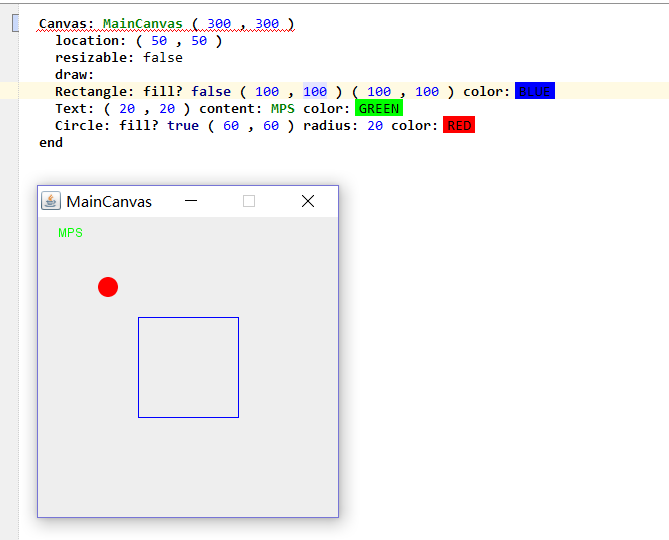

# ShapeBuilderLanguage

A DSL to draw graphics on a JFrame, which is built with JetBrains MPS.

It's an extended Shape language in the MPS tutorial, which has got more beautiful user interface.

You can build simple GUI, with DSL like this(the below picture shows how this language works):

# 

